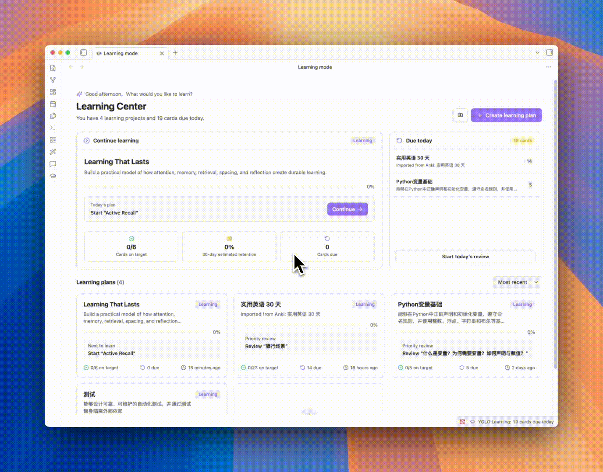

<h1 align="center">YOLO</h1>

  Assistente AI native per Obsidian — chat, scrittura, knowledge base e orchestrazione, tutto in un unico posto.

  
  
  
  

  <a href="./README.md">English</a> | <a href="./README_zh-CN.md">Chinese</a> | <b>Italiano</b>

  

## Novita recenti

- **`1.6`**: Introduce la nuova Modalità di apprendimento: trasforma qualsiasi argomento e materiale di riferimento in un progetto di studio personalizzato con scalette strutturate, concetti chiave, flashcard e una mappa interattiva delle conoscenze. La ripetizione dilazionata FSRS integrata e l'importazione di pacchetti Anki `.apkg` aiutano a trasformare le conoscenze in un percorso di ripasso sostenibile.

- **`1.5`**: Introduce un nuovo runtime Agent che trasforma l'AI da semplice Q&A in collaborazione attiva—con tool calling completo, MCP, Skills, Bash desktop, subagent e ricerca web—oltre a contesto e memoria per sessioni lunghe, RAG ibrido rinnovato, sincronizzazione del focus e consapevolezza PDF, e chat multi-finestra con Agent in background.

## Highlights

| Un'esperienza Agent completa e multipiattaforma | Trasforma la conoscenza del Vault in padronanza duratura |
|:--:|:--:|
|  |  |
| Non si limita a rispondere. YOLO comprende e gestisce direttamente il tuo Vault, utilizza strumenti e server MCP e applica le Skills per completare il lavoro secondo il tuo metodo. | Trasforma argomenti e materiali in un sistema di apprendimento personale, poi usa flashcard e ripassi basati su FSRS per convertire gli appunti salvati in conoscenze durature. |

## Funzionalità

Oltre alle capacità principali sopra descritte, YOLO fornisce anche:

| Funzionalità | Descrizione |
|--------------|-------------|
| 🔌 Supporto per Agent esterni | Collega client MCP come Hermes e OpenClaw alla ricerca nel Vault di YOLO oppure delega attività a un Agent YOLO configurato |
| ⚡ Quick Ask e Smart Space | Chiedi, modifica e continua a scrivere senza lasciare l'editor |
| 🔎 Vault RAG | Cerca nell'intero Vault per ottenere risposte fondate sui tuoi appunti |
| 🪟 Chat Multi-Finestra | Gestisci in parallelo attività e contesti diversi in finestre di chat indipendenti |
| 🧠 Sistema di memoria | Permette a YOLO di ricordare preferenze, abitudini e contesto a lungo termine per conversazioni piu coerenti |
| 🪡 Cursor Chat | Aggiunta contesto con un click, conversazione a portata di mano |
| ⌨️ Completamento Tab | Completamento AI in tempo reale per una scrittura più fluida e naturale |
| 🎛️ Supporto Multi-Modello | OpenAI, Claude, Gemini, DeepSeek e altri modelli mainstream, liberamente commutabili |
| 🌍 i18n | Supporto nativo multi-lingua |

## Quick Start

1. Apri Impostazioni Obsidian → Plugin Community → Browse → Cerca **"YOLO"**
2. Installa e abilita
3. Configura la tua API key nelle impostazioni del plugin, oppure usa il tuo ChatGPT OAuth / Gemini OAuth:
   - [OpenAI](https://platform.openai.com/api-keys) / [Anthropic](https://console.anthropic.com/settings/keys) / [Gemini](https://aistudio.google.com/apikey) / [Groq](https://console.groq.com/keys)
4. Apri la sidebar per iniziare a chattare — oppure prova Quick Ask digitando `@` nell'editor

## Installazione

### Store Plugin Community (Consigliato)

Vedi Quick Start sopra.

### Installazione Manuale

1. Vai su [Releases](https://github.com/Lapis0x0/obsidian-yolo/releases) e scarica l'ultima versione di `main.js`, `manifest.json`, `styles.css`
2. Crea la cartella: `<vault>/.obsidian/plugins/obsidian-yolo/`
3. Copia i file in quella cartella, poi abilita il plugin nelle Impostazioni di Obsidian

> [!WARNING]
> YOLO non può coesistere con [Smart Composer](https://github.com/glowingjade/obsidian-smart-composer). Disabilita o disinstalla Smart Composer prima di usare YOLO.

## Nota sul supporto mobile

A causa delle differenze di capacità tra Obsidian mobile e desktop, nel breve periodo YOLO non può allineare completamente su mobile tutte le funzionalità e l'esperienza disponibili su desktop. Inoltre, dato il tempo limitato che posso dedicare alla manutenzione del progetto, al momento posso garantire solo che YOLO rimanga utilizzabile su mobile, non che ogni funzione raggiunga lo stesso livello del desktop.

Se usi YOLO su mobile, potresti comunque incontrare funzionalità non disponibili, comportamenti non del tutto coerenti o adattamenti ancora incompleti in alcuni flussi di lavoro. Ti ringrazio per la comprensione.

## Roadmap

- [x] Ricerca Vault AI migliore e più forte
- [x] Agent in Background (automazione task lunghi)
- [x] Orchestrazione Multi-Agent (tramite subagent)
- [x] Learning Mode — una vista di studio dedicata
- [ ] Annotation Mode — annotazioni e suggerimenti AI in tempo reale sulle note
- [ ] Assistente integrato — helper fissato nell'angolo per config/agent, con compattazione automatica e task programmati
- [ ] Lavagna AI migliore
- [ ] Input vocale e note riunione

## Feedback & Issue

Hai trovato un bug, qualcosa di confuso o hai un'idea? Apri un issue:

🐛 [Segnala un bug](https://github.com/Lapis0x0/obsidian-yolo/issues/new?template=bug_report.yml) · ✨ [Richiedi una funzionalità](https://github.com/Lapis0x0/obsidian-yolo/issues/new?template=feature_request.yml)

Cosa aiuta di più:

- Bug con una riproduzione chiara (versione di Obsidian, sistema operativo, versione del plugin, cosa hai fatto, cosa è successo)
- Segnalazioni "ho provato X e ho ottenuto Y" — attriti UX, formulazioni confuse, documentazione rotta, traduzioni obsolete
- Idee di funzionalità concrete legate a un caso d'uso reale ("quando faccio A, vorrei B perché C")

Per favore cerca tra gli issue esistenti prima per evitare duplicati. I template sono in inglese.

## Contribuire

Sono benvenuti tutti i tipi di contributo — segnalazioni bug, miglioramenti documentazione, miglioramenti funzionalità.

**Per funzionalità maggiori, apri prima una issue per discutere fattibilità e implementazione.**

## Riconoscimenti

Grazie a [Smart Composer](https://github.com/glowingjade/obsidian-smart-composer) per il lavoro originale — senza di loro, YOLO non esisterebbe.

Ringraziamenti speciali a [Kilo Code](https://kilo.ai) per il loro sponsorship. Kilo è una piattaforma open-source di assistenti AI con 500+ modelli AI, che aiuta gli sviluppatori a costruire e iterare più velocemente.

  

## Supporto

Se trovi YOLO utile, considera di supportare il progetto:

  
  &nbsp;
  

I log di sviluppo sono regolarmente aggiornati sul [blog](https://www.lapis.cafe).

## Licenza

[MIT License](LICENSE)

## Star History

